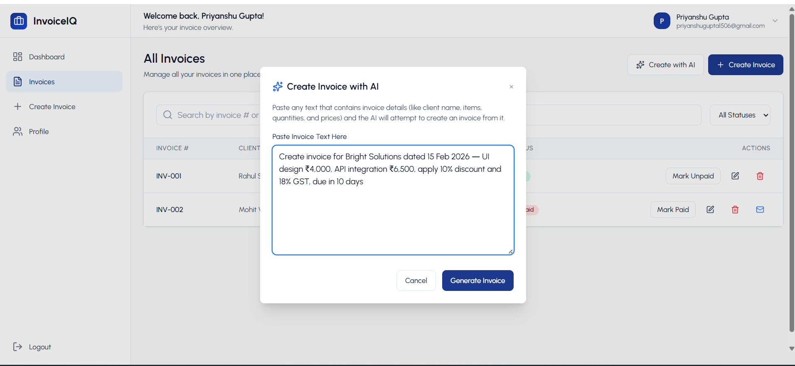
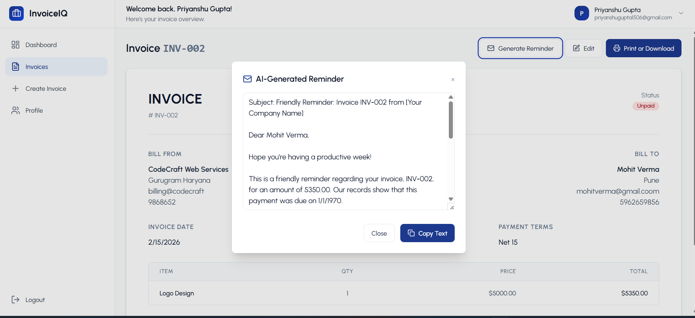
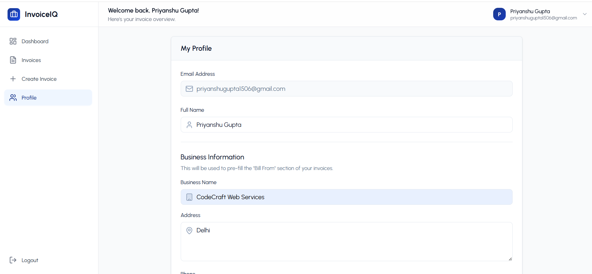

# 🧾 InvoiceIQ

**InvoiceIQ** is a production-ready, full-stack SaaS app for automating invoicing and basic finance workflows.

It turns plain text (emails, chats, notes) into structured invoices, sends AI-generated payment reminders, and shows revenue insights on a clean dashboard — all powered by **Google Gemini**.

> **Note:** This project uses Google Gemini AI for intelligent invoice parsing and payment reminder generation.

**Highlights**

-  Built with the **MERN stack** (MongoDB, Express, React, Node)
-  **AI features** using Google Gemini (`@google/generative-ai`)
-  **JWT authentication** + protected routes
-  **Responsive UI** with modern design
-  **Email reminders** for unpaid invoices


---

## 🖼️ Screenshots

###  Dashboard Overview


###  Create Invoice


###  AI-Generated Invoice


###  AI Payment Reminder Email


###  Profile Settings


---

## 🧠 Overview
InvoiceIQ is aimed at freelancers and small businesses who need simple but smart invoicing.

The app can:

Parse unstructured text into a structured invoice

Generate payment reminder emails with AI

Track paid / unpaid invoices and basic revenue stats

Manage user profile and business details

From a dev perspective, this project demonstrates:

Building a real SaaS-style app with authentication & dashboards

Integrating a modern AI API into an existing backend

Using Docker + CI/CD for repeatable deployments

Writing unit tests around core backend logic

---

## 🛠️ Tech Stack

| Layer                  | Technology                                      |
| ---------------------- | ----------------------------------------------- |
| **Frontend**           | React 18 (Vite) + TailwindCSS + Axios           |
| **Backend**            | Node.js + Express.js                            |
| **Database**           | MongoDB Atlas (with Mongoose ODM)               |
| **AI Engine**          | Google Gemini API (@google/genai)               |
| **Authentication**     | JWT + bcryptjs                                  |
| **Containerization**   | Docker + Docker Compose                         |
| **CI/CD**              | GitHub Actions                                  |
| **Testing**            | Jest + Supertest                                |
| **Environment Config** | dotenv                                          |

---

## ✨ Features

### 🔐 Authentication

* Secure signup/login using JWT
* Password hashing with bcrypt

### 🧾 Invoice Management

* Create, edit, delete, and filter invoices
* Auto-filled business details
* Export invoices as PDF

### 🧠 AI-Powered Tools

* **AI Invoice Generator:** Convert text → invoice instantly
* **AI Reminder Emails:** Generate payment reminders
* **AI Dashboard:** Summarize income, due payments, and insights

### 📱 Modern UI

* Responsive React + Tailwind design
* Dark mode ready

---

## 🏗️ Architecture Diagram


---

## 📂 Project Structure

```
InvoiceIQ/
│
├── backend/
│   ├── config/
│   │   └── db.js
│   ├── controllers/
│   │   ├── aiController.js
│   │   ├── authController.js
│   │   └── invoiceController.js
│   ├── middlewares/
│   │   └── authMiddleware.js
│   ├── models/
│   │   ├── Invoice.js
│   │   └── User.js
│   ├── routes/
│   │   ├── aiRoutes.js
│   │   ├── authRoutes.js
│   │   └── invoiceRoutes.js
│   ├── tests/
│   │   └── auth.test.js
│   ├── server.js
│   └── .env.example
│
├── frontend/
│   └── invoice-generator/
│       ├── src/
│       │   ├── assets/
│       │   ├── components/
│       │   ├── context/
│       │   ├── pages/
│       │   ├── utils/
│       │   ├── test/
│       │   │   └── fileMock.js
│       │   ├── App.jsx
│       │   ├── index.css
│       │   └── main.jsx
│       ├── public/
│       ├── screenshots/
│       ├── vite.config.js
│       └── jest.config.cjs
│
├── docs/
│   └── architecture.png
│
├── screenshots/
│   ├── dashboard.png
│   ├── create-invoice.png
│   ├── ai-generated.png
│   ├── reminder-email.png
│   └── profile-settings.png
│
├── docker-compose.yml
├── .github/workflows/        # CI/CD pipelines
├── .env.example              # root example env, if used
└── README.md

```

---

## ⚙️ Installation & Setup

### 🧩 Clone Repository

```bash
git clone https://github.com/priyanshugupta15/InvoiceIQ
cd InvoiceIQ
```

---

### 🖥️ Backend Setup

```bash
cd backend
npm install
```

Create a `.env` file inside the **backend** folder:

```env
MONGO_URI=your_mongodb_connection_string
JWT_SECRET=your_secret_key
GEMINI_API_KEY=your_gemini_api_key
GEMINI_MODEL=models/gemini-2.5-flash
PORT=8000
```

Run backend locally:

```bash
npm run dev
```

---

### 💻 Frontend Setup

```bash
cd ../frontend
npm install
npm run dev
```

Visit locally:
👉 [http://localhost:5173](http://localhost:5173)

---


## 🪪 License

This project is open-source under the **MIT License**.

---
