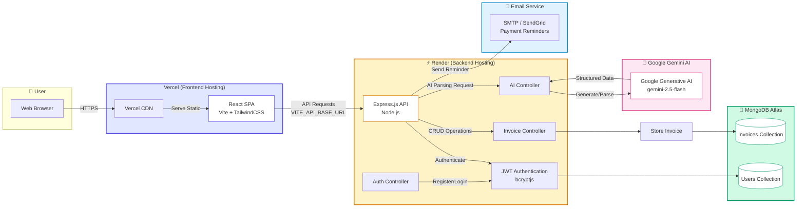

# InvoiceIQ System Architecture

## Architecture Components

### Frontend (Vercel)
- **React SPA** - Single Page Application built with Vite
- **TailwindCSS** - Utility-first CSS framework
- **Vercel CDN** - Global content delivery network

### Backend (Render)
- **Express.js API** - RESTful API server
- **JWT Authentication** - Secure token-based auth
- **Controllers** - Business logic handlers

### Database (MongoDB Atlas)
- **Users Collection** - User accounts and credentials
- **Invoices Collection** - Invoice documents

### External Services
- **Google Gemini AI** - AI-powered invoice parsing and generation
- **Email Service** - Payment reminder emails

## Data Flow

1. User accesses the application through Vercel CDN
2. React frontend serves static assets
3. API requests are sent to Render-hosted backend
4. Backend authenticates requests using JWT
5. Invoice data is stored/retrieved from MongoDB Atlas
6. AI requests are processed by Google Gemini API
7. Payment reminders are sent via email service
